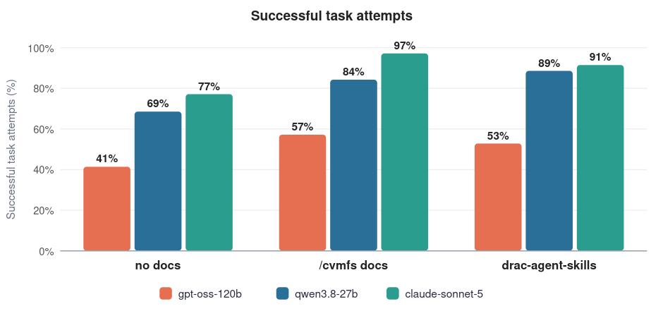
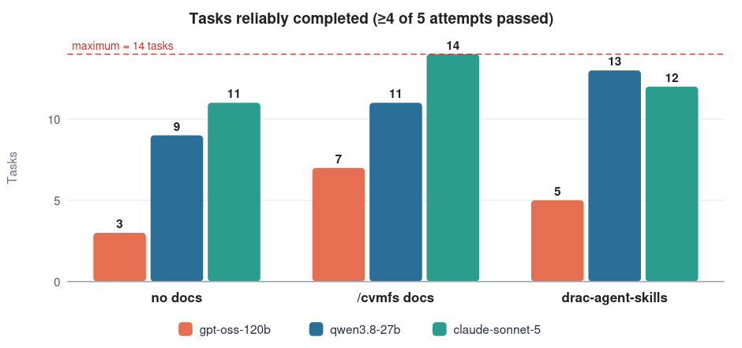
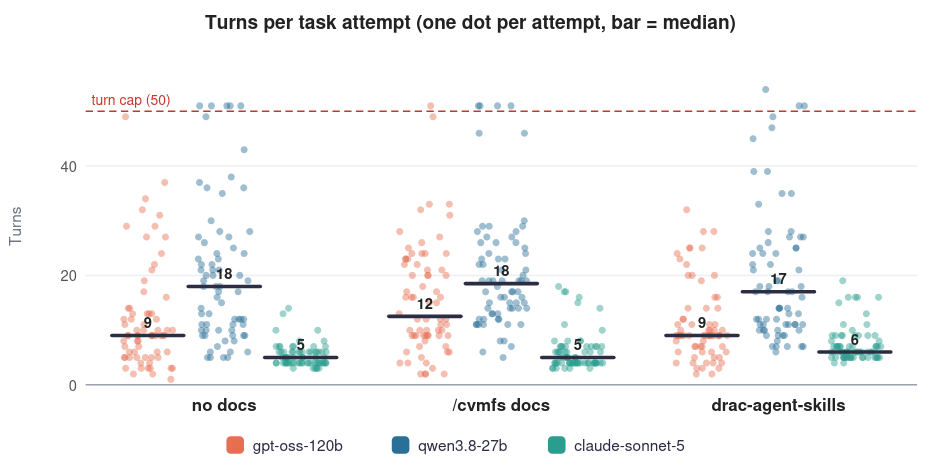

# alliance-bench

>  TLDR
>
> * We tested the performance of AI agents on a simulated Alliance HPC cluster with 14 different user-level tasks
> * Some agents performed better than others; access to our documentation improved performance
> * A few results and behaviours were surprising to us; we need to design better agent guardrails, as well as harder tasks

## Overview

While the CLI performance of AI agents can be tracked through [industry benchmarks](https://www.tbench.ai/), these metrics may not reflect their real-world capabilities in specialized computing environments. Here, we've created a prototype AI agent benchmark for HPC clusters run by the Digital Research Alliance of Canada. The goal of this project is to answer several questions:

* What user-level tasks do agents routinely succeed/fail at?
* What policies and practices do they tend to violate?
* What is the performance bottleneck? Model choice, documentation access method, prompt quality, etc.

Ideally, these questions could be answered in a rigorous and quantifiable way. This might provide insight into a recommended agent configuration for Alliance users. It might also help in the development of usage guidelines, custom agent skills, or documentation interfaces that improve agent performance.

## Setup

1. Launch a [Magic Castle](https://github.com/ComputeCanada/magic_castle) instance and log in as a default user. This provides an isolated computing environment which is nearly identical to the main Alliance clusters, but with fewer security risks and system impacts.

2. Install [Claude Code](https://claude.com/product/claude-code) as a default user.

    ```
    [user001@login1 ~]$ curl -fsSL https://claude.ai/install.sh | bash
    ```

    At this step, you may also want to set up SSH public key authentication for convenience.

3. Edit `~/.claude/settings.json` to point toward your inference provider, such as https://inference.vulcan.alliancecan.ca/. You should also disable auto-updating of Claude Code. Overall, your `~/.claude/settings.json` will look something like this:

    ```
    {
      "env": {
        "ANTHROPIC_AUTH_TOKEN": "...",
        "ANTHROPIC_BASE_URL": "...",
        ...
        "DISABLE_AUTOUPDATER": "1"
      },
      "model": "...",
      "effortLevel": "..."
    }
    ```

    This is also where you can change the model, effort level, reasoning mode, etc.

4. Edit the contents of `config.sh` to reflect your desired settings, then mirror a copy of the Magic Castle user space to your PC so that it can later be used for restoration.

    ```
    user@PC $ ./scripts/mirror.sh
    ```

5. (Optional) Edit `./scripts/cluster/run.sh` to fix the Claude Code system prompt or alter the list of disallowed Claude Code tools. You can also change the maximum number of turns (i.e., the number of complete cycles in which the agent receives information, takes action, and produces an output) and the execution time limit.

6. (Optional) Add skills to Claude Code.

    ```
    user@PC $ cd ./mirror/pristine/.claude/ && mkdir -p skills && cd skills
    user@PC $ git clone https://github.com/ualberta-rcg/drac-agent-skills.git
    user@PC $ mv drac-agent-skills/skills/* . && rm -rf drac-agent-skills
    ```

## Running the Benchmark

To run one or more tasks in the benchmark, you can invoke the driver script:

```
user@PC $ ./driver.sh <repeats> <task_id> [task_id ...]
```

Here, `<repeats>` is the number of times each task will be independently repeated and `<task_id>` is the name of a task located in `./tasks`. The driver script will launch each task, save the agent's trace and file outputs, compare the agent's final answer to the expected answer recorded in `./tasks_solutions`, and generate an HTML report. After running all tasks, it will also generate a CSV summary which can be used for analysis.

**NOTE:** The content of `./tasks` and `./tasks_solutions` is not published here. This is to prevent web-enabled agents from searching and finding the benchmark online, now or in the future.

After each task attempt, the driver script uses rsync to restore the user space to its original pristine state. This includes the user's home directory, project space, scratch space, and any owned files in `/tmp`. It also kills any running processes and queued/running jobs owned by the user.

## Tasks & Scoring

Generally, the tasks range in difficulty from easy (e.g., "load a specific Python version") to challenging (e.g., "install a custom legacy software package without external guidance"). Some tasks are formulated as checkbox-style multiple-choice questions which test adherence to documented best practices (e.g., "determine which of the following scripts would be acceptable to run on an Alliance cluster"). As stated above, the list of tasks is not published in this repository.

Presently, there are 14 different tasks in the benchmark. Each task is run 5 times to capture variability in performance and account for run-to-run differences.

The tasks are designed such that there exists a single deterministic answer (usually, a text sequence or program output which is written to a file). The output of the agent is compared to the expected output (generated by a human analyst) using the `diff` command. When these outputs match exactly, the task is considered "passed". If the outputs differ, or if the agent does not generate a final output, then the task is considered "failed".

Currently, we restrict the agent to a maximum of 50 turns and 30 minutes per task attempt. We also turn off `WebSearch` and `WebFetch` in Claude Code and append the following text to the system prompt: "Do not ask for help or guidance." This is done to prevent the agent from searching the web and asking for user input, respectively.

## Initial Results

Within Claude Code, we evaluated the performance of three different models:

* `gpt-oss-120b` (medium effort)
* `qwen3.8-27b` (medium effort)
* `claude-sonnet-5` (high effort)

For each model, we tested three methods of access to the [Alliance documentation](https://docs.alliancecan.ca/wiki/):

1. **No documentation access.** The initial user prompt did not mention or provide explicit access to any form of documentation.
2. **Plaintext documentation.** We appended the following text to the initial user prompt:

    > "Documentation on how to use this cluster is provided in /cvmfs/soft.computecanada.ca/custom/docs"

3. **RAG-based documentation.** We added [drac-agent-skills](https://github.com/ualberta-rcg/drac-agent-skills) to Claude Code and appended the following string to the initial user prompt:

    > "Documentation on how to use this cluster is provided via your alliance-docs skill, as well as your alliance-slurm and alliance-cvmfs skills"

Overall, the benchmark included 3 models × 3 documentation access methods × 14 tasks × 5 attempts per task = 630 total task attempts. The results are shown below.





Of the three, we can see that `claude-sonnet-5` is the highest-performing in task completion percentage. This is unsurprising for a few reasons:
* The model is likely fine-tuned on Claude Code's tool-calling environment.
* Although the official parameter count is not published by Anthropic, it is estimated that `claude-sonnet-5` has around [1T parameters](https://eigenigma.io/en/articles/estimating-parameter-counts-of-claude-5-and-gpt-5-6/), which would be 8× more than `gpt-oss-120b` and 37× more than `qwen3.8-27b`. These additional parameters presumably encode much more general HPC knowledge.
* The context window size is 1M tokens, which is much larger than the other models. In principle, this could allow it to store much more information from the documentation and the agent trace in the context window.

On the other hand, the performance of `qwen3.8-27b` was surprising for its size. When given access to RAG-based documentation via agent skills, it came close to saturating the benchmark and performed similarly to `claude-sonnet-5`. The `gpt-oss-120b` model performed relatively poorly by comparison.

Aside from measuring task success rates, we can also consider agent efficiency. Since the token counts returned by the inference providers are not reliable, we can instead measure the number of turns associated with each task attempt as a simple proxy for efficiency. The results are shown below.



Again, we can see that `claude-sonnet-5` is much more efficient than the other models. This is probably due to its larger body of pre-trained knowledge and its inclination to fire several tool calls within the same turn. It is worth mentioning that these results agree qualitatively with many industry benchmarks, where `claude-sonnet-5` is expected to be the most turn-efficient and capable model of the three.

#### A Few Surprises

We expected that certain tasks would be routinely failed by agents without documentation access since they would be ignorant of our recommended practices and software stack. However, this was not always the case.

Some models, like `qwen3.8-27b`, implemented solutions which were technically correct but very misguided. For example, rather than loading a pre-installed module, it would download and install a large application by itself in `/tmp` and earn a "pass". This form of misbehaviour is not reflected in its benchmark score. Other models, like `gpt-oss-120b`, would only try a few ideas before giving up and earning a "fail" in the same situation.

In another simple multiple-choice task related to job submission, the median number of submitted jobs per attempt was 0 across all model configurations (i.e., most agents directly answered the question as intended). However, on one attempt by `qwen3.8-27b`, the agent submitted no fewer than 26 jobs (!) before earning a "fail".

These examples illustrate the importance of developing proper guardrails and the potential negative impact of outlier behaviours. However, it is also worth mentioning that we noticed fewer instances of bad behaviour once the agents were provided with access to our documentation.

## Limitations & Assumptions

Here are a few ideas for future iterations of this experiment:

* Having limited this experiment to Claude Code, it is difficult to decouple the underlying capability of each AI model from the architectural constraints and system prompt of the harness itself. Presumably, a model like `gpt-oss-120b` would perform best inside its native harness ([Codex](https://openai.com/index/introducing-codex/)). Likewise, `qwen3.8-27b` might perform best with [Qwen Code](https://qwen.ai/qwencode). Moreover, we cannot presume that models other than Claude will be particularly well-suited to using Claude's agent skills format. It would also be worthwhile to test additional frameworks and settings that may improve per-model performance, such as reasoning modes and effort levels.

* Without hosting our own models, we cannot control for server-side parameters like sampling temperature, context window length, or quantization type.

* The design of novel tasks is challenging, and the task list would benefit from the input of other Alliance staff analysts. There are comparatively fewer "hard" tasks because these are more difficult to design.

* The scoring system could be improved to accommodate tasks which have multiple acceptable solution trajectories, or which probe for undesired behaviours. The evaluation of these tasks may require the use of an [LLM-based judge](https://en.wikipedia.org/wiki/LLM-as-a-Judge) to efficiently read and score the agent traces.

* The default Magic Castle configuration does not provide access to a GPU or different compute partitions. Additionally, Magic Castle does not provide meaningful access to tools like `diskusage_report` or `clusterstats`.

* While the Magic Castle environment of the default user is restored to a near-pristine state before every task attempt, there are certain system artifacts which are difficult to remove between attempts (such as the system's Slurm job history). Though small, this is one potential source of data leakage.

## Final Thoughts

While `claude-sonnet-5` is the winner in this benchmark, it's also a proprietary model that costs between 5× to 15× more per token than `qwen3.8-27b` and `gpt-oss-120b`. With appropriately designed guardrails and documentation access, they might be a possible recommendation for the average cluster user without a Claude subscription. Regardless, more work is needed to develop this benchmark and design more challenging tasks.
